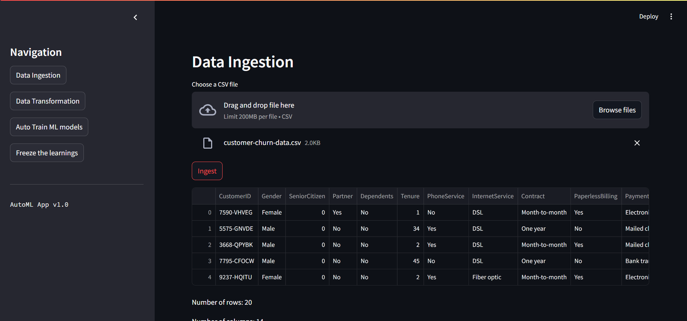
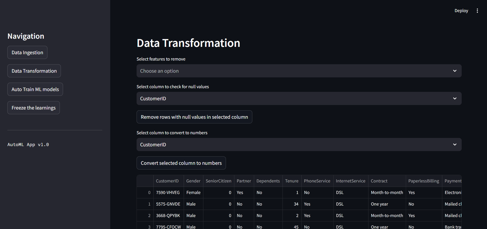
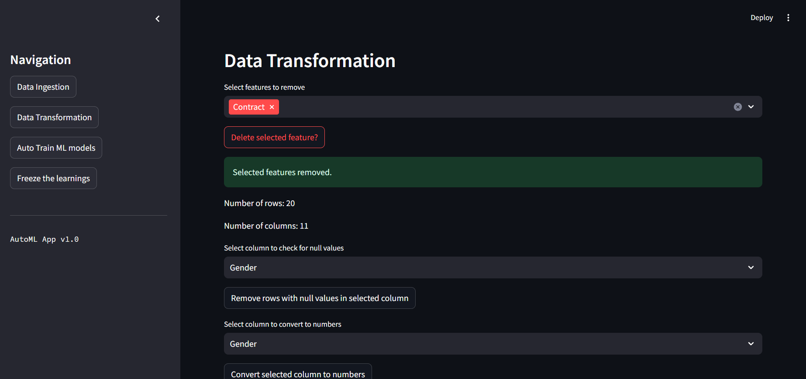
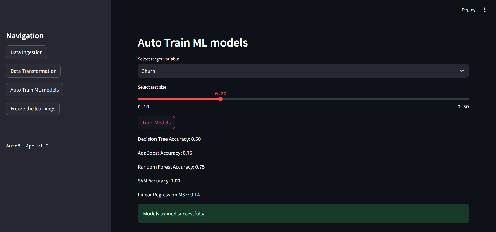
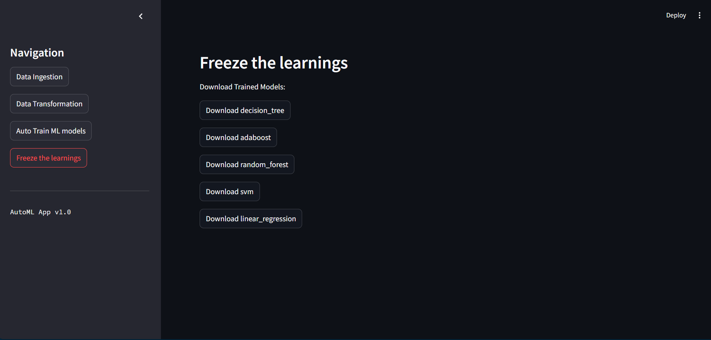

# 🤖 AutoML Streamlit App


A powerful and user-friendly AutoML application built with Streamlit, empowering users to perform automated machine learning tasks with ease.

## 📋 Table of Contents

- [Features](#features)
- [Screenshots](#screenshots)
- [Installation](#installation)
- [Usage](#usage)
- [Models](#models)
- [Contributing](#contributing)
- [License](#license)

## ✨ Features

Our AutoML Streamlit App offers a range of features to streamline your machine learning workflow:

- 📤 **Data Ingestion**: Easily upload your CSV files
- 🔧 **Data Transformation**: 
  - Remove unwanted features
  - Handle null values
  - Convert categorical data to numerical
- 🧠 **Auto Train ML Models**: 
  - Decision Tree
  - AdaBoost
  - Random Forest
  - SVM
  - Linear Regression
- 💾 **Model Export**: Save and download trained models

## 📸 Screenshots

Here are some screenshots of the AutoML Streamlit App in action:


*Data Ingestion Page*


*Data Transformation Page*


*Deleting Features in Data Transformation Page*


*Auto Train ML Models Page*


*Freeze the Learnings Page*


*Downloading SVM model in Freeze the Learnings Page*

## 🚀 Installation

To get started with the AutoML Streamlit App, follow these steps:

1. Clone the repository:
   ```
   git clone https://github.com/yourusername/automl-streamlit-app.git
   ```

2. Navigate to the project directory:
   ```
   cd automl-streamlit-app
   ```

3. Create a virtual environment (optional but recommended):
   ```
   python -m venv venv
   source venv/bin/activate  # On Windows, use `venv\Scripts\activate`
   ```

4. Install the required packages:
   ```
   pip install -r requirements.txt
   ```

## 🖥️ Usage

To run the AutoML Streamlit App:

1. Ensure you're in the project directory and your virtual environment is activated (if you created one).

2. Run the Streamlit app:
   ```
   streamlit run app.py
   ```

3. Open your web browser and go to `http://localhost:8501` to access the app.

4. Follow the intuitive interface to upload your data, perform transformations, train models, and export the results.

## 🤖 Models

The AutoML Streamlit App supports the following machine learning models:

- Decision Tree Classifier
- AdaBoost Classifier
- Random Forest Classifier
- Support Vector Machine (SVM)
- Linear Regression (for continuous target variables)

## 🤝 Contributing

We welcome contributions to improve the AutoML Streamlit App! Here's how you can contribute:

1. Fork the repository
2. Create a new branch (`git checkout -b feature/AmazingFeature`)
3. Make your changes
4. Commit your changes (`git commit -m 'Add some AmazingFeature'`)
5. Push to the branch (`git push origin feature/AmazingFeature`)
6. Open a Pull Request

Made with ❤️ by [Amitesh Mishra]

If you find this project helpful, please give it a ⭐️!